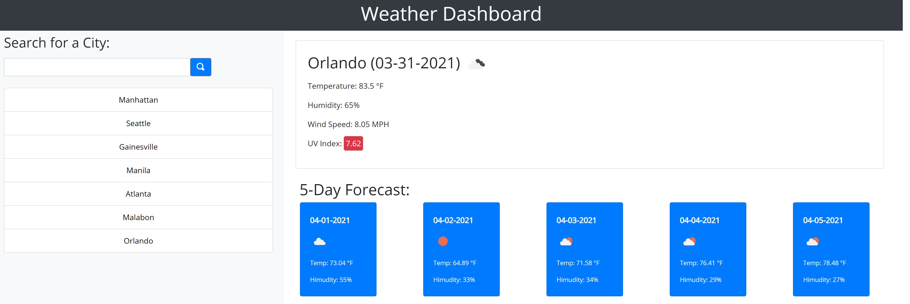

# Weather Dashboard

## Table of Contents

1. [Description](#Description)
2. [GitHub Repo and Deployment](#GitHub-Repo-and-Deployment)
3. [Screenshots](#Screenshots)
4. [Technologies](#Technologies)

## Description

* Weather Dashboard is an interactive weather application that allows a user to search a city name and the application will return various weather information. Weather Dashboard utilizes OpenWeatherMap API for acquiring weather information data. Local Storage is utilized to save pase searched cities. 
 - Weather for the current day as well as for the next 5 days will be displayed.
 - The application reloads every thirty minutes when the webpage remains open.
 - All searched cities will be displayed. Click on past searched cities to re-display its weather information.

## GitHub Repo and Deployment
 * [Deployed Site](https://ronan-codes.github.io/weather-dashboard/)
 * [GitHub Repo](https://github.com/Ronan-Codes/weather-dashboard.git)

## Screenshots
 

## Technologies
* OpenWeatherMap API
* HTML
* CSS & Bootstrap
* JavaScript & Jquery
* Moment.js
